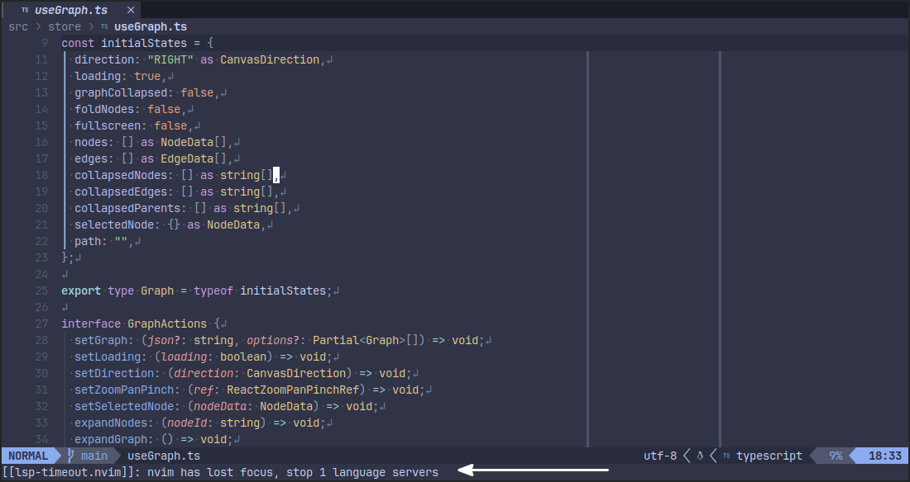

<!---->

<div align="center">
  <h1 align="center">🔌  lsp-timeout.nvim</h2>
</div>



<!-- Use badges from https://shields.io/badges/ -->
[](https://www.paypal.me/biteofpie)
[](https://github.com/hinell/fossil-license)

> _Nvim plugin for nvim-lspconfig: stop idle servers & restart upon focus; keep your RAM usage low_

## Overview

Some LSP servers are terribly inefficient at memory management and can
easily take up gigabytes of RAM MBs if left unattended (just like VS Code huh?!). 
This plugin prevents excessive memory usage by stopping and restarting LSP servers 
automatically keeping neovim fast.


## ⚡Features

- Stop & start LSP servers upon demand
- Lower RAM usage by unsed Neovim system window

## 🔒Requirements

- [Neovim 0.8+](https://github.com/neovim/neovim/releases)
- [nvim-lspconfig](https://github.com/neovim/nvim-lspconfig)

## 📦 Installation

#### [packer.nvim](https://github.com/wbthomason/packer.nvim)
```lua
-- $HOME/.config/nvim/lua/user/init.lua
packer.setup(function(use)
    use({
         "hinell/lsp-timeout.nvim",
        requires={ "neovim/nvim-lspconfig" },
        setup = function()
            vim.g["lsp-timeout-config"] = {
                ...
            }
        end
    })
end)
```

#### [lazy.vim](https://github.com/folke/lazy.nvim)
```lua
require("lazy").setup(
    {
	"hinell/lsp-timeout.nvim",
	dependencies={ "neovim/nvim-lspconfig" }
    }
)
```

#### [vim-plug](https://github.com/junegunn/vim-plug)
``` vim
Plug "hinell/lsp-timeout.nvim"
```

<!-- ## 🚀 Usage -->
 

## ⚙️ Configuration
See [DOCUMENTATION]

### Troubleshooting 
There might some limitations however with LSP servers which don't keep cache
on hdd. Some plugins that require active LSP servers like those used for signs
may fail. Please, fill the issue for the respective plugin so they check against
`vim.lsp.get_clients(...)`. 


### [DOCUMENTATION]
### [CONTRIBUTING]
### [DEVELOPMENT]

[DOCUMENTATION]: doc/index.md 'Contribution instructions (see also source code files)'
[CONTRIBUTING]: CONTRIBUTING.md 'Contribution instructions (see also source code files)'
[DEVELOPMENT]: DEVELOPMENT.md 'Devloper documentation (see also source code files)'
[d]: #project

### SUPPORT DISCLAIMER
[ps]: #production-status--support 'Production use disclaimer & support info'

_NO GUARANTEES UNTIL PAID. This project is supported and provided AS IS. See also [LICENSE]._

[LICENSE]: LICENSE

----

September 26, 2023</br>
Copyright ©  - Alexander Davronov (a.k.a Hinell), et.al.</br>
